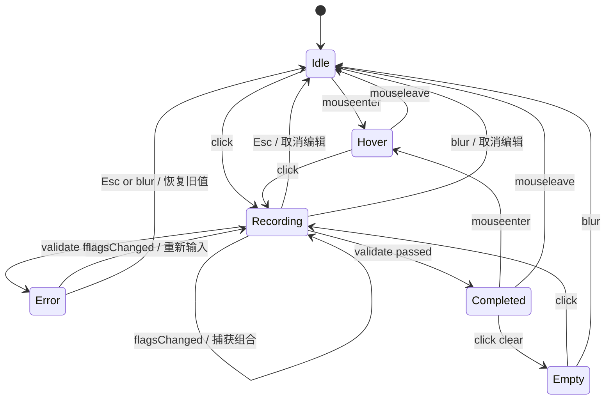

# ShortcutRecorder 组件状态机与验收标准

## 组件定位

`ShortcutRecorder` 用于设置页里的快捷键绑定项。它负责展示当前快捷键、进入录入、捕获按键组合、校验冲突、反馈错误、清空绑定，并在合法输入后通知全局热键系统刷新。

当前 Galt 的快捷键场景是 macOS 的「按住说话」触发键，因此组件只接受 `fn` 与修饰键组合，避免普通字符键在目标应用中产生输入副作用。

## 状态机



## 状态定义

| 状态 | UI 表现 | 行为说明 |
|---|---|---|
| `Idle` | 浅色输入框；已绑定时展示 key chips，未绑定时展示「输入快捷键」 | 默认展示态 |
| `Hover` | 输入框 hover 描边增强，并通过 tooltip 显示「更改快捷键」 | 提示可编辑 |
| `Recording` | 深色描边，显示「输入快捷键」 | 正在监听真实键盘事件 |
| `Error` | 红色描边，保留「输入快捷键」提示 | 当前组合不可用，不保存 |
| `Completed` | 展示新 key chips | 合法快捷键已录入并保存 |
| `Empty` | 显示「输入快捷键」 | 用户清空了可选快捷键 |

## 事件与动作

| 事件 | 来源状态 | 动作 | 目标状态 |
|---|---|---|---|
| `mouseenter` | `Idle / Completed` | 显示 hover 样式与 tooltip | `Hover` |
| `mouseleave` | `Hover` | 隐藏 hover 样式 | `Idle / Completed` |
| `clickInput` | `Idle / Hover / Empty` | 记录旧值，开始监听键盘事件 | `Recording` |
| `flagsChanged` | `Recording / Error` | 捕获 `fn` / 修饰键组合并格式化 | 待校验 |
| `validateSuccess` | `Recording` | 更新值、发送热键变更通知 | `Completed` |
| `validateFail` | `Recording` | 设置错误原因，不提交 | `Error` |
| `clickClear` | `Completed` | 清空当前绑定 | `Empty` |
| `Esc` | `Recording / Error` | 放弃修改，恢复进入编辑前的值 | `Idle / Completed` |
| `blur` | `Recording / Error` | 结束录入，不保存非法快捷键 | `Idle / Completed` |

## 校验规则

1. 必填快捷键不能为空；可选快捷键允许通过清空按钮设置为 `none`。
2. 不能使用系统保留组合，命中后提示「此快捷键已被系统保留」。
3. 不能与同一设置页内其他功能重复，命中后提示「此快捷键已被其他功能使用」。
4. 普通字符键不允许作为按住说话触发键，命中后提示「仅支持 fn 和修饰键组合」。
5. 重复校验使用 canonical 顺序比较，`fn+rshift` 与 `rshift+fn` 视为同一组合。
6. 展示时保留录制顺序，便于用户理解自己刚才按下的组合。
7. `Esc` 不保存本次编辑，并恢复进入录入态之前的旧值。

## 验收标准

1. 悬停在已绑定快捷键区域时，系统 tooltip 显示「更改快捷键」。
2. 点击快捷键区域后，组件进入录入态，显示「输入快捷键」，并开始捕获键盘组合。
3. 输入合法组合后，组件展示为 key chips，例如 `fn` + `⇧ 右`。
4. 输入系统保留快捷键时，组件红色描边，并且不会保存该组合。
5. 输入与其他功能冲突的快捷键时，组件红色描边，并且不会覆盖旧绑定。
6. 错误态下再次输入新快捷键，可以重新校验并覆盖错误。
7. 点击清空按钮后，允许为空的快捷键绑定被删除，值保存为 `none`。
8. 按 `Esc` 可取消本次编辑，并恢复进入编辑前的快捷键。
9. 组件失焦时不会保存非法快捷键。
10. 快捷键保存成功后，刷新设置页仍能展示最新绑定。
11. 同一页面多个快捷键项之间的冲突校验生效。
12. 组件在亮色与暗色模式下均使用 `Palette` 语义色，并保持焦点、错误、hover 状态可区分。

## 实现数据结构

```swift
private enum ShortcutRecorderState: Equatable {
    case idle
    case hover
    case recording
    case error(String)
    case completed
}

struct HotkeyCombo: Equatable {
    var keys: [HotkeyKey]
    var rawValue: String
    var canonicalRawValue: String
}
```

## 当前落地范围

- 组件文件：`Sources/Galt/HotkeyRecorder.swift`
- 快捷键 canonical 比较：`Sources/Galt/HotkeyManager.swift`
- 设置页重复绑定校验：`Sources/Galt/SettingsWindow.swift`
